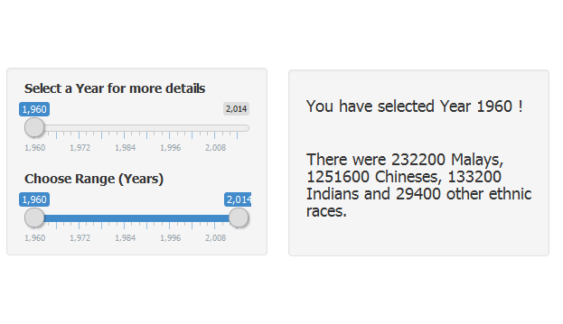
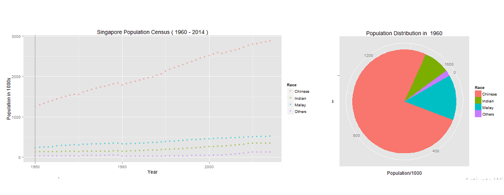

## Singapore Population Census Between 1960 and 2014

This data product allows users: 

- Query for Singapore population between 1960 and 2014

- Display trend and growth rate Singaporean Population and groupedd by race (Malay, Chinese, Indian, Others) graphically

- Display the total number of Singapore citizens and grouped by race (Malay, Chinese, Indian, Others) at a specific year

Data Source - [Singapore Department of Statistics](http://www.singstat.gov.sg/statistics/browse-by-theme/population-and-population-structure)

--- .class #id 

## Data Product Screen 

# Slider Inputs and Query Results 

--- .class #id 

## Data Product Screen 

# Interactive Charts

--- .class #id 

## Thank you for your interest!

For more information, please refer to the followings:

- [Data Product Showcase](https://joshlai.shinyapps.io/shiny/)

- Data Product Source Code 

- Presentation Slides

- Presentation Souce Code
